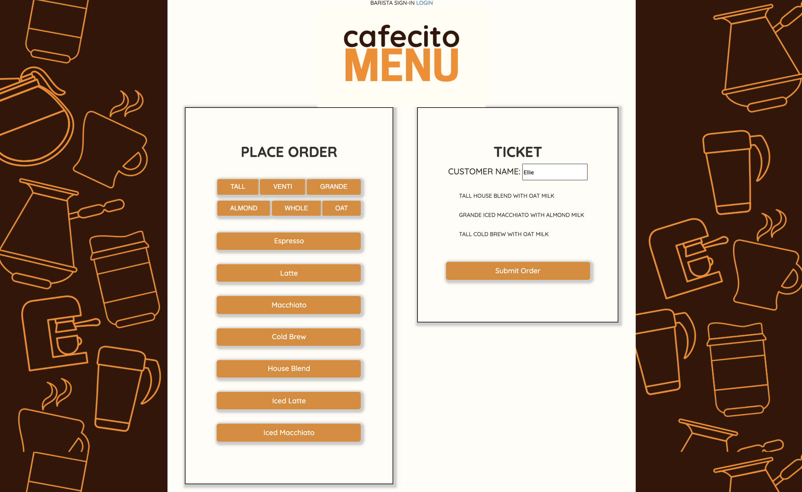
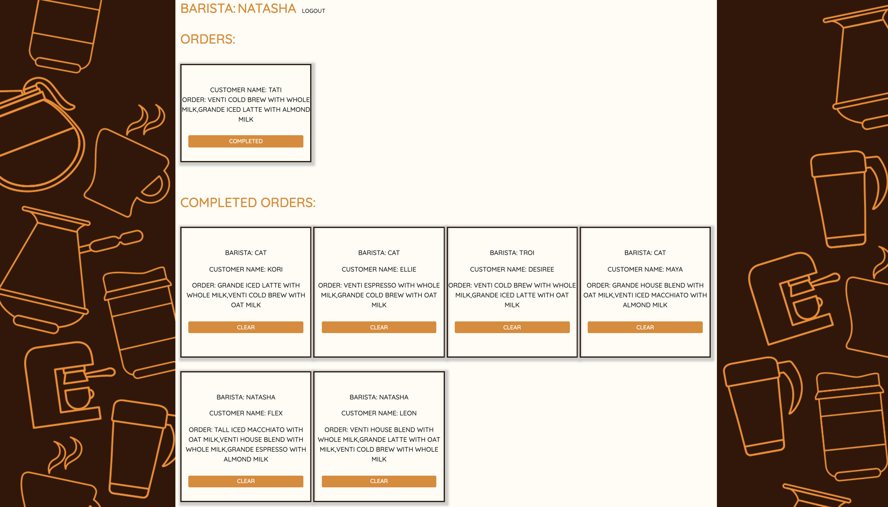

# Barista Full Stack Application

# Description: 

Created a web application that allows any barista to add an order, there's a link where the barista on shift can sign-in, view pending and completed orders, and mark an order complete. Once the barista hits complete, the app says the customer's name out loud.
# Tech Used:

 HTML, CSS, JS, API, JSON, NODE.JS, EXPRESS, MONGODB, USER AUTH
